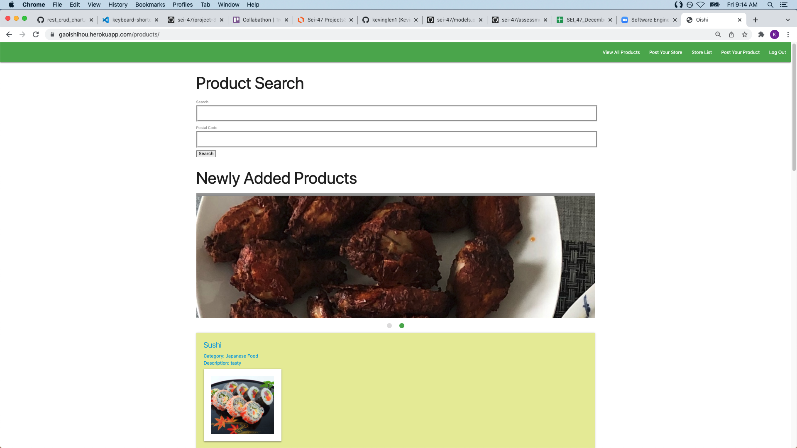

# App Title: OISHI
An app dedicated to finding the availabilty of cultural specialty foods in grocery stores.

# Screenshot(s): 

# Technologies Used: 
Django, Python, Materialize, PostgreSQL, HTML, CSS

# Getting Started:

Deployed App:
https://gaoishihou.herokuapp.com/

Trello Board:
https://trello.com/b/VkiH3uuO/collabathon

# Next Steps: 

- Add a wishlist for each user
- Postal code filtering of locations

